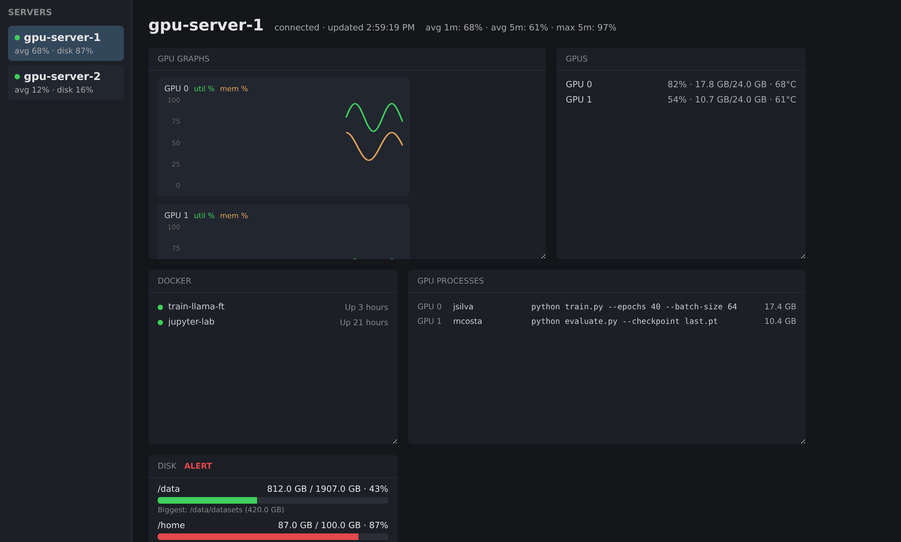

# nvtop-tracker

A lightweight, real-time GPU & disk monitoring dashboard for a handful of
remote servers. It polls each server over SSH (GPU utilization/memory/temp,
disk usage, Docker containers, GPU processes) and streams updates to a
browser dashboard — no agents to install on the remote hosts, no database,
just SSH and a couple of standard CLI tools.



## Features

- **Multi-server**: watch several GPU servers from one dashboard, switch
  focus from the sidebar.
- **Live GPU metrics**: per-GPU utilization, memory, and temperature,
  polled every couple of seconds with a rolling 5-minute history graph.
- **Disk usage**: per-mount usage with a configurable alert threshold, plus
  an optional "biggest subfolder" scan for mounts you care about.
- **Docker & GPU processes**: running containers, images, and which
  processes (and users) are actually using each GPU.
- **Freely rearrangeable dashboard**: drag blocks to any position on a
  snap-to-grid, resize them from the corner handle — your layout persists
  in the browser.
- **Zero agents**: everything is collected by shelling out to `ssh`, so
  auth, `ProxyJump`, and connection reuse all resolve exactly like they
  would from your terminal (via `~/.ssh/config`, an SSH agent, etc).

## Requirements

- Node.js >= 18 on the machine running the dashboard.
- SSH access to each server you want to monitor, resolvable the same way
  `ssh <host>` resolves on your command line (key-based auth — no password
  prompts, since polling uses `BatchMode=yes`).
- On each monitored server: `nvidia-smi`, `df`, `ps`, and (optional)
  `docker` and `du` on your `PATH`.

## Getting started

```bash
npm install
cp config.example.json config.json
# edit config.json with your servers
npm start
```

Then open `http://localhost:3000`.

`config.json` is gitignored — it's meant to hold your real server
hostnames and is never meant to be committed.

## Running as a service (Ubuntu / systemd)

To keep the dashboard running in the background, restart it on crash, and
start it at boot:

```bash
npm install
cp config.example.json config.json   # then edit it
sudo ./deploy/install.sh             # or: sudo ./deploy/install.sh <user>
```

The service runs as the user who invoked `sudo` (or the one you pass), so
it uses that user's `~/.ssh/config` and keys. It does **not** see your
desktop SSH agent: the keys it needs must be readable without a passphrase
prompt (e.g. listed via `IdentityFile` in `~/.ssh/config`).

Re-run `install.sh` after moving the repo or changing Node versions.

```bash
systemctl status nvtop-tracker
sudo systemctl restart nvtop-tracker   # after editing config.json
journalctl -u nvtop-tracker -f         # logs
sudo ./deploy/uninstall.sh             # remove the service
```

## Configuration

All fields are optional except `servers`; anything you omit falls back to
the default shown below (see `src/config.js`).

| Field | Default | Description |
|---|---|---|
| `servers` | `[]` | Array of `{ name, host, user?, port? }`. `host` is anything `ssh` accepts — a hostname or an alias from `~/.ssh/config`. |
| `port` | `3000` | Port the dashboard listens on. |
| `gpuPollIntervalMs` | `2000` | How often to poll GPU metrics. |
| `diskPollIntervalMs` | `300000` | How often to poll disk usage, Docker, and GPU processes. |
| `gpuHistoryMinutes` | `5` | Length of the rolling GPU history used for graphs/trends. |
| `diskStorageAlertThreshold` | `85` | Usage percent (per mount) that triggers the alert badge. |
| `sshRetryMaxAttempts` / `sshRetryDelayMs` | `3` / `5000` | Retry behavior for a failed SSH command, with exponential backoff. |
| `diskTopFolderMountPrefixes` | `[]` | Mounts (or prefixes) to run the "biggest subfolder" `du` scan against, e.g. `["/data"]`. |
| `duTimeoutSeconds` | `25` | Time limit for the remote `du` scan; a slow/huge filesystem just reports the biggest folder found so far. |
| `gpuQueryCommand`, `diskQueryCommand`, `dockerQueryCommand`, `dockerImagesQueryCommand`, `gpuUuidQueryCommand`, `gpuProcessesQueryCommand` | — | The exact remote commands used to collect each kind of data, in case you need to adapt them for your environment. |

## Development

```bash
npm test
```

Tests cover the parsers, the rolling history buffer, and the SSH retry
logic — no live servers required.

The design doc under `docs/superpowers/specs/` has more detail on the
original architecture decisions.

## License

MIT — see [LICENSE](LICENSE).
